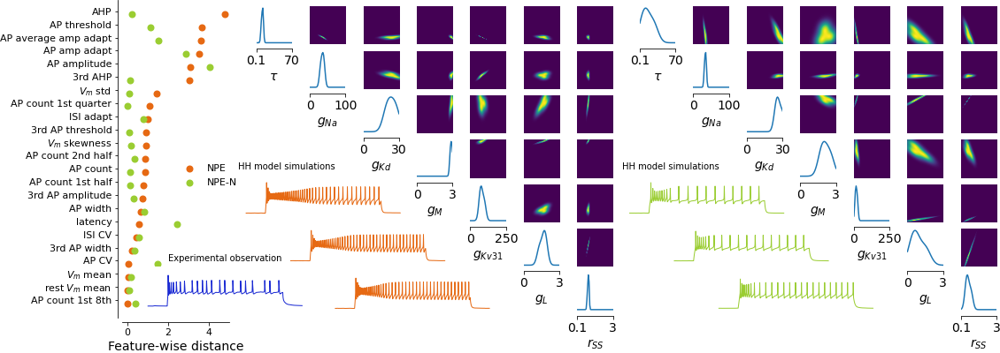

# Computational Approaches to Bridge Experimental and Simulation Viewpoints in Neuroscience
 

 
**Yves Bernaerts**
 
 
This repo contains raw data, preprocessed data, code and figures belonging to my PhD thesis. It also contains the latex code based on the [kaobook template](https://github.com/fmarotta/kaobook) with which the pdf can be rendered.

## Papers
This thesis capitulates a couple of works, published and unpublished, and with much of the code available on GitHub.
 
1. Most notably for this thesis: *Hybrid statistical-mechanistic modeling links ion channel genes to physiology of cortical neuron types* which can be found on [BioArxiv](https://www.biorxiv.org/content/10.1101/2023.03.02.530774v1) and with code [here](https://github.com/berenslab/hh_sbi).
2. *Sparse bottleneck neural networks for exploratory non-linear visualization of Patch-seq data* that can be found on [ArXiv](https://arxiv.org/abs/2006.10411) with code [here](https://github.com/berenslab/sBNN).
3. *Sparse reduced-rank regression for exploratory visualization of paired multivariate data* that can be found [here](https://rss.onlinelibrary.wiley.com/doi/10.1111/rssc.12494) with code [here](https://github.com/berenslab/patch-seq-rrr).
4. *Phenotypic variation of transcriptomic cell types in mouse motor cortex* that can found in [Nature](https://www.nature.com/articles/s41586-020-2907-3) with code [here](https://github.com/berenslab/mini-atlas).
5. *Efficient identification of informative features in simulation-based inference* that can found as a [NeurIps](https://openreview.net/forum?id=AYQI3rlp9tW) conference paper and with code [here](https://github.com/berenslab/fslm).

## Data
Some raw electrophysiological recordings in `.nwb` format can be found in `data/raw_data/`. They serve as exemplary cells to illustrate some of the results. All raw electrophysiological recordings that have been used in multiple studies that make up the bulk of this thesis can be found on [DANDI](https://dandiarchive.org/dandiset/000008/draft).
 
Most of the preprocessed data is in `data/`. Yet some files are too big for upload on GitHub. These include:
1. full_batch.npz that can be downloaded from [Zenodo](https://zenodo.org/record/7716391).
2. SmartSeq_cells_AIBS.pickle that also can be downloaded from [Zenodo](https://zenodo.org/record/5118962#.Y-IkqHbMIuU).
Please put those 2 files in `data/` if you consider to work with the code.

## Code
Small analyses and figures have been produced with code in the main directory.
1. `ephys_extraction.ipynb` shows how to use the automated electrophysiological (ephys) feature extraction pipeline. It also produces a sketch illustrating its functionalities. Also check `ephys_extractor.py` and `ephys_features.py`, code worked with more extensively [here](https://github.com/berenslab/EphysExtraction) and based on the Allen [SDK](https://github.com/AllenInstitute/AllenSDK/tree/master/allensdk/ephys).
 
2. `hodgkin-huxley.ipynb` illustrates the Hodgkin-Huxley-based model, implemented with the [Brian2](https://brian2.readthedocs.io/en/stable/) simulator. Also check `simulator.py`, `ephys_extractor_hh.py` and `ephys_features_hh.py`.
 
3. `sbnn.ipynb` produces figures illustrating results from using sparse bottleneck neural networks or **sBNNs** for the nonlinear prediction of ephys measurements based on gene expression levels.
 
4. `npe-n.ipynb` introduces Neural Posterior Estimation with Noise or **NPE-N** and shows it performs better on real-world experimental data, such as electrophysiological recordings, than its baseline counterpart **NPE**. We produce figures showing this for very specific cells. For the inference results used here, we capitalize on the simulation-based inference package [sbi](https://github.com/mackelab/sbi) (also check **Usage** below).
 
5. `bridge_genotype_to_phenotype.ipynb` shows how sparse reduced-rank regression can be utilized to bridge the genotype of a neuron --- in the form of its gene expression levels --- to Hodgkin-Huxley model parameters, and specificially those that can generate simulations that reproduce the raw ephys recording, both qualitately and quantitatively.

## Figures
In `figures/`, you can find most figures (not including sketches) that are included in the thesis.

## Usage
Install the following dependencies before you run the notebook.
 
`pip install -r requirements.txt`

## Contact
Contact me at yves.bernaerts@research.fchampalimaud.org
